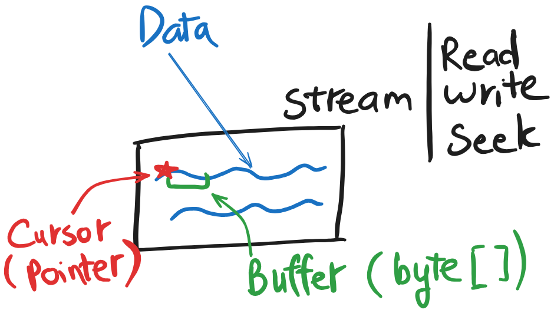
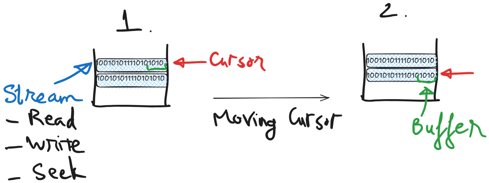
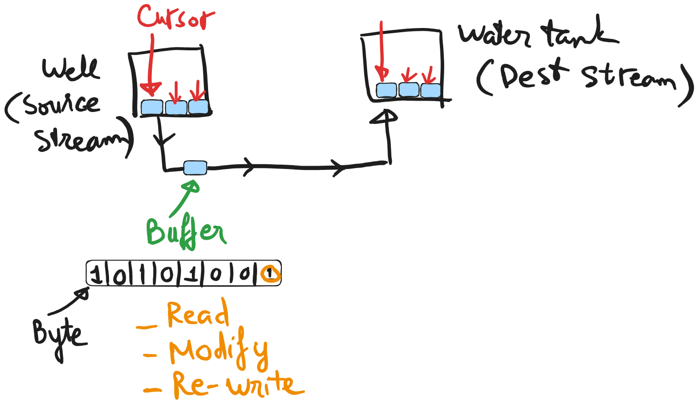

# Stream C#

## What is stream?

### Definition
A stream is an abstraction of sequence of bytes, such as an file, an I/O device, or an TCP/IP socket.
Stream involes three fundamental operations:
- Read data as bytes from stream
- Write bytes to stream
- Modifying cursor on stream

### Analogy

We can think the stream is like a glass tank of water, in there we can do various actions such as:
- **Read**: Know what kind of water sotred inside the tank.
- **Write**: Put more water into our tank.
- **Seek**: Dive into a specific part of the tank to find exactly the piece of water you need, without checking every drop.

## Why stream?

Imagine you have an very deep well (very large file), it contains a large amout of water (large data). And your mission is getting the deepest piece of water for experiment. I have 2 options for you to complete your mission:

1. Using pump to load all of water into the water factory and get the piece you want. In this way your need:
- Build a large tank to load all these water (large memory loaded)
- Take time to pump (load) these water into tank

2. Rent a professional diver (cursor), give him a box and dive to get the targeted piece and then bring it up.
- Build a small box (buffer) to store your targeted piece of water (small memory)
- Using cursor (pointer) to move exactly where you want to go and pickup what you want to pick.

Absolutely, we choose the second option (using stream) which take smaller memory and dynamic cursor as you can define your target and just focus to achieve them. Instead of the first option that need to load whole thing to just get a small thing.
Streams are ideal for working with large or continuously generated data, like network streams or huge files that don't fit into memory all at once.

## How the stream Work?

1. Stream has an internal cursor to track the current position of reading process. This cursor will move around and read your data.
2. After moving the cursor to the target position using Seek(), we can read data byte-by-byte or using a buffer.

## Copying water analogy

In this example, our missing is moving water (data) from well (source file) to water tank (targeted file). Here are the steps:

1. Using Stream to read data (water) from source stream (well).
2. Moving cursor and read a buffer of data (portion water).
3. With each buffer (water) we can preprocessed for transforming data (filtering or add mineral to your water)
4. Moving cursor and write buffer to targeted stream (water tank)

## Q&A

1. Is a buffer (byte[]) required?
No, you don't need to have an array of bytes to store data, you can read/write a single byte such as you can pick up a drop of water.
Reading a single byte is possible but generally inefficient for large files, as it's slower than reading larger portions with a buffer.

2. If buffer (byte[]) is optinal, so why should we use buffer?
- Performance improvement: Handle larger block, meaning you can handle more data and it's faster absolutely. Think about when you want to move a mount of water, should you pick a single drop or use a **bucket**?
- Memory management: Define a byte[] means you declare a memory access for these data, we can efficiently process these managed data.
